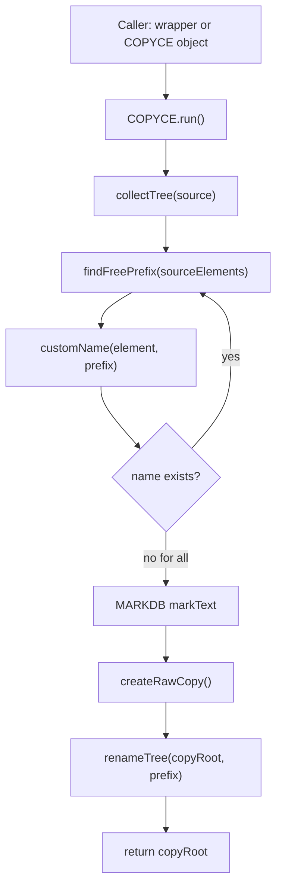

# COPYCE

`COPYCE` is a temporary but reusable PML object for copying a database element and renaming copied named elements with configurable naming rules.

Main file:

```text
pmllib\mylib\design\copyfunc\copyce.pmlobj
```

## Object Usage

Default:

```pml
!copy = object COPYCE(!!ce, !!ce.owner)
!newCopy = !copy.run()
```

Custom prefix:

```pml
!copy = object COPYCE(!!ce, !!ce.owner, 'clone')
!newCopy = !copy.run()
```

Custom prefix, undo mark, and mode:

```pml
!copy = object COPYCE(!!ce, !!ce.owner, 'pbcopy', 'Copy pipe branch', 'PIPEBRANCH')
!newCopy = !copy.run()
```

Inspect result:

```pml
q var !copy.copyRoot
q var !copy.lastPrefix
q var !copy.lastRenamed
```

## Function Wrappers

```pml
!newCopy = !!copyCeWithCopyofNames(!!ce, !!ce.owner)
!newCopy = !!copyCeWithPrefixRoot(!!ce, !!ce.owner, 'clone')
!newCopy = !!copyCeWithPrefixRootMark(!!ce, !!ce.owner, 'clone', 'Clone current CE')
!newCopy = !!copyCeWithMode(!!ce, !!ce.owner, 'typecopy', 'TYPEPREFIX', 'Test TYPEPREFIX')
```

## Naming Modes

### DEFAULT

```pml
!copy = object COPYCE(!!ce, !!ce.owner, 'copyof', 'Copy DEFAULT', 'DEFAULT')
!newCopy = !copy.run()
```

Examples:

```text
/copyof-PipeName
/copyof-BranchName
```

### TYPEPREFIX

```pml
!copy = object COPYCE(!!ce, !!ce.owner, 'typecopy', 'Copy TYPEPREFIX', 'TYPEPREFIX')
!newCopy = !copy.run()
```

Examples:

```text
/typecopy-PIPE-PipeName
/typecopy-BRAN-BranchName
```

### PIPEBRANCH

```pml
!copy = object COPYCE(!!ce, !!ce.owner, 'pbcopy', 'Copy PIPEBRANCH', 'PIPEBRANCH')
!newCopy = !copy.run()
```

Examples:

```text
/pbcopy-P-PipeName
/pbcopy-B-BranchName
/pbcopy-EQUI-EquipmentName
```

### LOWER

```pml
!copy = object COPYCE(!!ce, !!ce.owner, 'lowercopy', 'Copy LOWER', 'LOWER')
!newCopy = !copy.run()
```

Examples:

```text
/lowercopy-pipename
/lowercopy-branchname
```

## Test

```pml
!created = !!copyCeTestCurrent()
```

The test creates four copies using:

```text
DEFAULT
TYPEPREFIX
PIPEBRANCH
LOWER
```

Undo:

```pml
UNDODB 4
```

## Flow



## Customizing

Edit `copyce.pmlobj`:

```pml
define method .customName(!sourceElement is DBREF, !prefix is STRING) is STRING
```

Add a new mode by extending `.customName()` and adding a helper method if needed.
