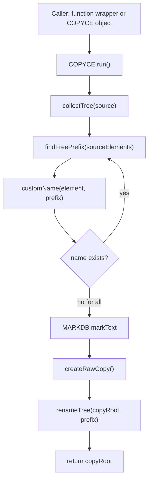

# COPYCE test and usage notes

Temporary PML copy helper location:

`C:\Program Files (x86)\AVEVA\Everything3D2.10\PMLLIB\mylib\design\copyfunc`

## Main object

```pml
!copy = object COPYCE(!!ce, !!ce.owner)
!newCopy = !copy.run()
```

This copies current `CE` under its owner and renames named elements with default mode:

```text
/copyof-OriginalName
/copyof-(2)-OriginalName
```

## Naming modes

### DEFAULT

```pml
!copy = object COPYCE(!!ce, !!ce.owner, 'copyof', 'Copy DEFAULT', 'DEFAULT')
!newCopy = !copy.run()
```

Example names:

```text
/copyof-PipeName
/copyof-BranchName
```

### TYPEPREFIX

```pml
!copy = object COPYCE(!!ce, !!ce.owner, 'typecopy', 'Copy TYPEPREFIX', 'TYPEPREFIX')
!newCopy = !copy.run()
```

Example names:

```text
/typecopy-PIPE-PipeName
/typecopy-BRAN-BranchName
```

### PIPEBRANCH

```pml
!copy = object COPYCE(!!ce, !!ce.owner, 'pbcopy', 'Copy PIPEBRANCH', 'PIPEBRANCH')
!newCopy = !copy.run()
```

Example names:

```text
/pbcopy-P-PipeName
/pbcopy-B-BranchName
/pbcopy-EQUI-EquipmentName
```

### LOWER

```pml
!copy = object COPYCE(!!ce, !!ce.owner, 'lowercopy', 'Copy LOWER', 'LOWER')
!newCopy = !copy.run()
```

Example names:

```text
/lowercopy-pipename
/lowercopy-branchname
```

## Function wrappers

One-shot default copy:

```pml
!newCopy = !!copyCeWithCopyofNames(!!ce, !!ce.owner)
```

One-shot custom prefix:

```pml
!newCopy = !!copyCeWithPrefixRoot(!!ce, !!ce.owner, 'clone')
```

One-shot custom prefix and undo mark:

```pml
!newCopy = !!copyCeWithPrefixRootMark(!!ce, !!ce.owner, 'clone', 'Clone current CE')
```

One-shot custom mode:

```pml
!newCopy = !!copyCeWithMode(!!ce, !!ce.owner, 'typecopy', 'TYPEPREFIX', 'Test TYPEPREFIX')
```

## Test script

Run this on a safe test element:

```pml
!created = !!copyCeTestCurrent()
```

It creates four copies of current `CE` under `CE.owner`:

```text
DEFAULT
TYPEPREFIX
PIPEBRANCH
LOWER
```

Each copy creates its own `MARKDB` undo mark.

Undo examples:

```pml
UNDODB
UNDODB 4
```

## PostEvents test

Install optional undo/redo callbacks:

```pml
!ok = !!copyCeInstallPostEvents()
```

Disable callback output without removing the global object:

```pml
!ok = !!copyCePostEventsEnabled(FALSE)
```

Enable again:

```pml
!ok = !!copyCePostEventsEnabled(TRUE)
```

## Flow



## Files

```text
copyce.pmlobj                     main COPYCE object
copycepostevents.pmlobj           optional !!postEvents object
copyCeTestCurrent.pmlfnc          test runner
copyCeWithMode.pmlfnc             one-shot mode wrapper
copyCeWithCopyofNames.pmlfnc      old default wrapper
copyCeWithPrefixRoot.pmlfnc       custom prefix wrapper
copyCeWithPrefixRootMark.pmlfnc   custom prefix + mark wrapper
```
